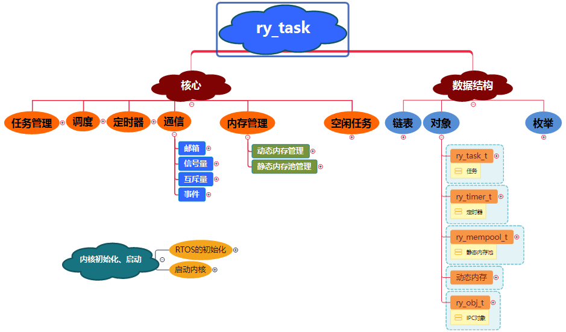

# ry_task  
一款轻量级的RTOS，目前已实现：  
* **优先级抢占式调度**  
* **软件定时器，阻塞延时**  
* **同步/通信机制**  
* **内存管理（静态、动态）**  

---

# 系统结构  
## ry_task框图  
  
## 文件结构  
ry_task  
 │  ry_core.c       //核心  
 │  ry_core.h  
 │  ry_hw.c         //硬件接口  
 │  ry_hw.h  
 │  ry_idle.c       //空闲任务  
 │  ry_ipc.c        //同步/通信机制  
 │  ry_ipc.h  
 │  ry_mem.c        //内存管理  
 │  ry_mem.h  
 │  ry_scheduler.c  
 │  ry_timer.c      //软件定时器  
 │  ry_timer.h  
 │  ry_list.h       //双向链表  
 │  ry_type.h       //内核的数据类型定义  
 │  ry_conf.h       // 内核的配置文件  
 │  ry_lib.h        //内核的API接口  
 │  
 └─cpu  
     ry_stack.c     //任务栈的初始化  
     ry_switch.s    //任务切换，目前适配了Cortex-M3  
		 
---		 

		 
